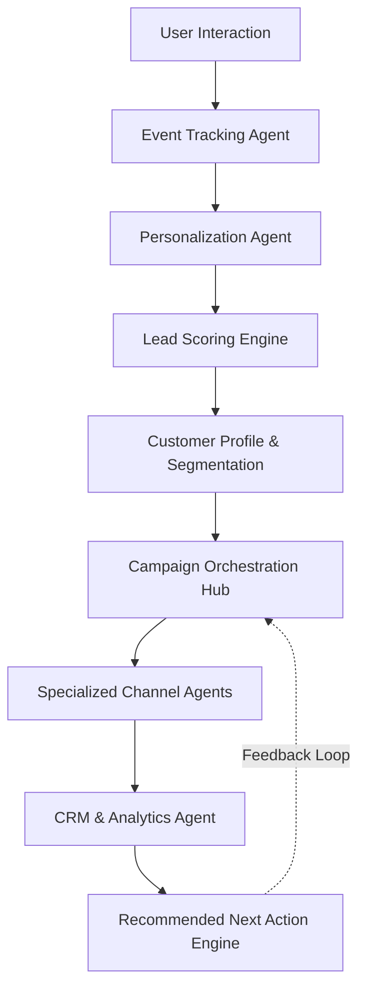

# AI-Powered Marketing Agent Platform
## Developer Onboarding & Technical Documentation

Welcome to the **AI-Powered Marketing Agent Platform**! This documentation is designed to introduce new developers to the project. It explains the core purpose of the system, how all the different components talk to each other, and where the project currently stands.

Even if you have never seen this project before, this guide will take you step-by-step through our architecture, setup, and current challenges.

---

## 1. Project Summary: What and Why

### What the project does
This project is an AI-powered marketing prototype that automatically orchestrates marketing campaigns based on user behavior. It tracks what a user does, evaluates their intent, dynamically alters what they see (personalization), and then automatically delegates outbound marketing tasks (like drafting emails, SMS, and social media posts) to specialized AI agents.

### Why the project was built
Currently, marketing teams have to manually tie together event tracking, lead scoring, and content creation across disconnected tools. This platform was built to prove that an **orchestrated multi-agent architecture** can handle the entire marketing funnel autonomously—making fast, data-driven decisions while keeping humans in the loop when necessary.

---

## 2. Overall Architecture

The platform uses a split architecture:
*   **Web Interfaces:** Streamlit for the main dashboard/frontend flow, and static HTML/CSS/JS for standalone prototype visual flows.
*   **Backend Server:** FastAPI application handling the heavy lifting, logic, and API calls.
*   **Database:** SQLite storing all logs, users, scores, and campaign histories.
*   **Intelligence:** HuggingFace Inference APIs are used to power the specialized generative text agents.

### High-Level Data Flow



---

## 3. End-to-End Workflow

When a user interacts with our marketing assets, the following workflow is triggered step-by-step:

1.  **Interaction:** A user clicks a link, views a page, or submits a form.
2.  **Tracking:** The *Event Tracking Agent* captures this granular data and logs it.
3.  **Real-Time Personalization:** Based on the immediate interaction, the *Personalization Agent* modifies landing page assets and Calls-To-Action (CTAs) dynamically.
4.  **Scoring:** The raw events are pushed to the *Lead Scoring Engine*, which increments or decrements the user's intent score.
5.  **Segmentation:** The newly updated score triggers the *Segmentation logic*, placing the user into a specific tier (Bronze, Silver, Gold, Platinum).
6.  **Orchestration:** The *Campaign Orchestration Hub* evaluates the segment, checks recent campaign cooldowns, and decides if it is time to trigger a new outreach campaign.
7.  **Channel Execution:** If a campaign is authorized, specialized *Channel Agents* (Email, SMS, Social) utilize the HuggingFace APIs to draft hyper-personalized content.
8.  **Analytics & Feedback:** The *CRM & Analytics Agent* monitors if the user engages with the new outreach. This data feeds into the *Recommended Next Action Engine*, adjusting strategies for future campaigns.

---

## 4. Agent-by-Agent Explanation

The system is highly modular. Each "agent" is responsible for a specific slice of the marketing lifecycle:

*   **Event Tracking Agent:** A listener that securely captures every click, scroll depth, form submission, and CTA interaction.
*   **Personalization Agent:** Serves different variations of frontend content. If the user is flagged as high-intent, it might show a "Book a Demo" CTA instead of a "Sign Up for Newsletter" CTA.
*   **Lead Scoring Engine:** A mathematical rules engine. It processes raw events into behavioral intent scores (e.g., Form Submit = +50 points, Bounce = -10 points).
*   **Customer Profile + Segmentation:** Evaluates the aggregate score and handles the categorization tier of a lead.
*   **Campaign Orchestration Hub:** The "Manager" agent. It doesn't write content; it coordinates. It handles the routing logic, rate limits (cooldowns), and checks if campaigns need manual approval.
*   **Specialized Channel Agents:** 
    *   *Email Agent:* Drafts long-form, persuasive copy.
    *   *SMS Agent:* Drafts short, urgent, context-aware text messages.
    *   *Social Agent:* Formats content for LinkedIn/Twitter, generating relevant hashtags.
*   **CRM + Analytics Agent:** Acts as the system of record. It aggregates all data to show campaign ROI, engagement rates, and conversion metrics.
*   **Recommended Next Action Engine / Feedback Loop:** Uses historical analytics to suggest what the subsequent step should be for a specific user, tuning the Orchestration Hub's future routing logic.

---

## 5. Technical Components Stack

### Frontend Explanation
We utilize **Streamlit** to provide a fast, reactive administrative dashboard. It visualizes the current lead scores, allows administrators to review campaign drafts, and manages the orchestration hub. There are also raw HTML/CSS/JavaScript components used for isolated prototype flows (like the mock user-facing website).

### Backend Explanation
The core logic is powered by **FastAPI**. It handles all incoming requests from the frontend, manages the routing to our HuggingFace API integrations, evaluates lead scoring logic, and orchestrates the agent-to-agent communication. FastAPI was chosen for its asynchronous capabilities, which are crucial when waiting for LLM generation responses.

### Database Explanation
We use **SQLite** (via the `marketing_agent.db` file) for lightweight persistence. It stores all relational data including event logs, current user segments, campaign statuses, and generated content.

### File and Folder Explanations
*   `marketing_api/`: Contains the FastAPI application, route definitions, and agent backend logic.
*   `marketing_frontend/`: Contains the Streamlit application code and specialized UI components.
*   `streamlit_app.py`: The main entry point to launch the Streamlit frontend.
*   `requirements.txt`: Python package dependencies.
*   `marketing_agent.db`: The SQLite local database.
*   `seed_data.py`: A utility script used to inject dummy user profiles and events into the database for testing.
*   `ai_marketing_agent_full_prototype2.html`: A static prototype file demonstrating UI concept mockups.

---

## 6. Deep Dive: Core Logic Systems

### AI Orchestration Logic
The orchestrator operates on a "State Machine" concept. It takes the output from the segmentation engine, evaluates the user's historical cadence (to prevent spamming), and dispatches distinct prompts to the LLMs (HuggingFace) depending on the required channel.

### Manual vs. Automatic Campaign Mode
*   **Automatic Mode:** The Orchestration Hub generates the campaign asset via the HuggingFace API and immediately sends it.
*   **Manual Mode:** The generated asset is flagged as "Pending Approval." It is pushed to the Streamlit UI, where a real marketing manager must click "Approve" before the system simulates sending the message.

### Lead Scoring Logic
Scores are computed chronologically based on captured events. Certain events have predefined weights. The score decays slightly over time if the user becomes inactive. 

### Audience Segmentation Logic
A simple tiering system directly tied to the Lead Score:
*   `0 - 49`: **Bronze** (Nurture phase)
*   `50 - 89`: **Silver** (Engagement phase)
*   `90 - 149`: **Gold** (Sales-ready phase)
*   `150+`: **Platinum** (VIP handling)

### API Integration Flow
FastAPI acts as the middleman.
1. Streamlit (Frontend) -> HTTP GET/POST -> FastAPI (Backend).
2. FastAPI processes the logic, querying SQLite.
3. For text generation, FastAPI formats the prompt and executes an external REST call to HuggingFace Inference APIs.
4. The response is parsed, optionally stored in SQLite, and returned to the Frontend.

---

## 7. Current Project Status

### ✅ Completed Working Features
*   The raw Event Tracking data model and SQLite database schema.
*   Basic Lead Scoring math and Audience Segmentation functionality.
*   Streamlit UI dashboard structure.
*   Backend Python FastAPI boilerplate and agent routing logic.
*   Static HTML/CSS prototyping flows.

### ⚠️ Partially Working / Broken Features (Current Issues)
*   **HuggingFace API Integration:** Currently returning `404 Not Found` errors. We either have an incorrect endpoint URL, a deprecated model name, or invalid API tokens.
*   **Personalization API Instability:** Some API calls fail because the text generation endpoints take too long or timeout.
*   **Email Delivery Pipeline:** The logic to actually dispatch emails is a stub. It is incomplete.
*   **AWS / Third-Party Integrations:** Need general debugging; currently not authenticating correctly.

### 🚀 Future Roadmap
1.  **Stabilize LLM Integration:** Fix HuggingFace 404 errors or migrate to a more stable provider (e.g., OpenAI/Anthropic/Gemini).
2.  **Implement Real Email Dispatch:** Integrate SendGrid or AWS SES to replace the stubbed email pipeline.
3.  **Real-Time WebSocket Feedback:** Update Streamlit to show live event streams via websockets.
4.  **Advanced Analytics Dashboard:** Build out the missing CRM reporting UI.

---

## 8. Setup Instructions for New Developers

To get the project running locally, follow these steps:

1.  **Clone the Repository** and navigate to the project root.
2.  **Create a Virtual Environment:**
    ```bash
    python -m venv venv
    ```
    *(Activate it: `source venv/bin/activate` on Mac/Linux or `.\venv\Scripts\activate` on Windows)*
3.  **Install Dependencies:**
    ```bash
    pip install -r requirements.txt
    ```
4.  **Database Setup:**
    Initialize and populate the database with test data:
    ```bash
    python seed_data.py
    ```
5.  **Environment Variables:**
    Set up your `.env` file with your HuggingFace API key (`HUGGINGFACE_API_KEY=your_key_here`).
6.  **Run the Backend Applications:**
    You will likely need two terminal windows:
    *   Start the FastAPI Server: `uvicorn marketing_api.main:app --reload` (check specific path inside `marketing_api/`)
    *   Start the Streamlit UI: `streamlit run streamlit_app.py`

---

## 9. Developer Handoff Notes & Pending Tasks

**To the Next Developer:**
Welcome! Your immediate priority should be resolving the `404` errors dropping from the HuggingFace API. Without a stable LLM connection, the specialized channel agents cannot generate content. Check the inference URL and model name used in the FastAPI routes.

### Pending Tasks Checklist
- [ ] Debug and fix HuggingFace 404 API Error.
- [ ] Add retries to the Personalization API calls to handle long generation times.
- [ ] Connect AWS credentials properly in the environment variables.
- [ ] Replace the Email Agent's stub function with an actual AWS SES or SendGrid integration.
- [ ] Verify that `seed_data.py` covers edge cases (negative lead scores, etc.).

Good luck, and build something awesome!
